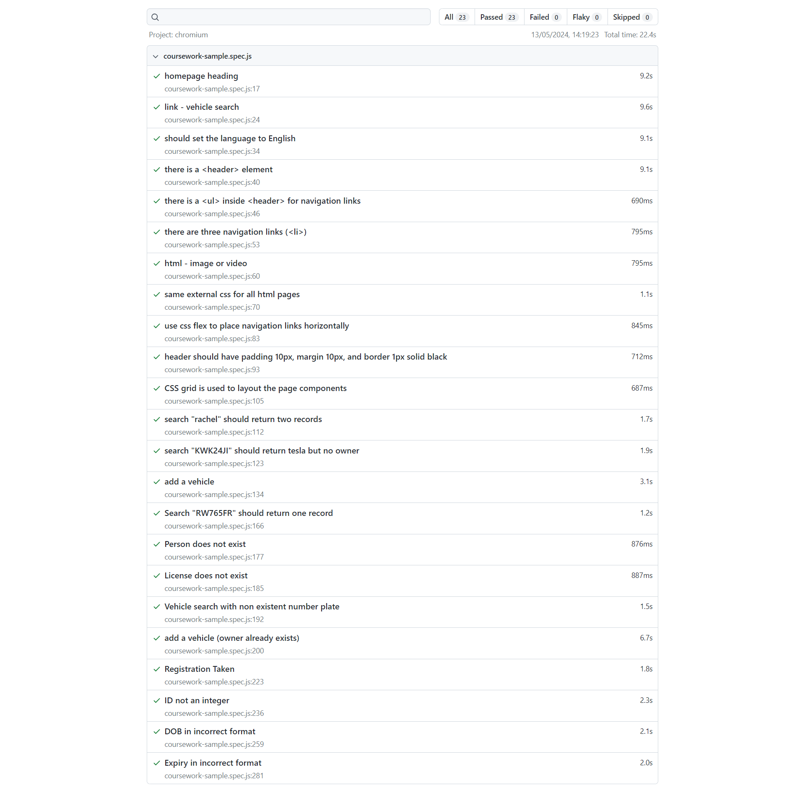

# Additional Work Completed
Below I outline the additional work I did & tests I created. Some of the work was in the spec, but I created a test for it to make sure it works (e.g. People Search with License Number). Some of it was not in the spec and is extra additions I have made (e.g. Checking if ID is an integer). I have created tests for these as well to make sure they work. All is described below.
 
I have also added links to each file so you can see the relevant lines of code if you wish.

## Links to Files

### People Search
[people-search.html](People-Search/people-search.html)
 
[people-search.js](People-Search/people-search.js)

### Vehicle Search
[vehicle-search.html](Vehicle-Search/vehicle-search.html)
 
[vehicle-search.js](Vehicle-Search/vehicle-search.js)

### Add Vehicle
[add-vehicle.html](Add-Vehicle/add-vehicle.html)
 
[add-vehicle.js](Add-Vehicle/add-vehicle.js)

### Playwright Tests
[coursework-sample-spec.js](tests\coursework-sample.spec.js)

## Additional HTML
* Not Attempted

## Additional CSS
* Not Attempted

## Additional JS

### People Search With License Number
* I have created a test for this to make sure that details about a person can be retrieved by using the license number. It will correctly display 'Search successful' when the user inputs a license number that is in the database. You can see the code for this from lines 174-208 in people-search.js. The code for the test for this is on lines 165-173 in coursework-sample-spec.js.

### People Search With A Person Who Doesn't Exist
* I have created a test to make sure that the correct message is shown when a person search is attempted for a person who doesn't exist. It will correctly display 'No result found' when the user inputs a person that is not in the database. You can see the code for this from lines 165-169 in people-search.js. The code for the test for this is on lines 176-181 in coursework-sample-spec.js.

### People Search With A License Number Which Doesn't Exist
* I have created a test to make sure that the correct message is shown when a person search is attempted with a license number that doesn't exist. It will correctly display 'No result found' when the user inputs a license number that is not in the database. You can see the code for this from lines 203-207 in people-search.js. The code for the test for this is on lines 184-189 in coursework-sample-spec.js.

### Vehicle Search With A Non-Existent Number Plate
* I have created a test to make sure that the correct message is shown when a vehicle search is attempted with a number plate that doesn't exist. It will correctly display 'No result found' when the user inputs a number plate that is not in the database. You can see the code for this from lines 137-141 in vehicle-search.js. The code for the test for this is on lines 191-197 in coursework-sample-spec.js.

### Add A Vehicle When The Owner Is Already In The Database
* I have created a test to make sure that the add vehicle page still works correctly even when the owner is already in the database. It will correctly retrieve the PersonID for that person, and assign that to the vehicle instead of allowing the user to input it along with other information. You can see the code for this from lines 129-134 in add-vehicle.js. The code for the test is on lines 199-219 coursework-sample-spec.js.

### Add A Vehicle When The Registration Is Already Taken
* This is an additional feature that I have added to the website. This feature will check the database to see if that registration has already been used, and then if it has will output a message to the user to tell them that the registration is already taken. You can see the code for this from lines 96-111 in add-vehicle.js. The code for the test is on lines 222-232 in coursework-sample-spec.js.

### Enter A Person ID That Isn't An Integer
* This is an additional feature that I have added to the website. This feature will check if the ID that the user has entered is an integer or not. If it isn't an integer then it will output a message to the user to tell them that the ID must be an integer. You can see the code for this from lines 211-217 in add-vehicle.js. The code for the test is on lines 235-255 in coursework-sample-spec.js.

### DOB In The Incorrect Format
* This is an additional feature that I have added to the website. This feature will check if the DOB that the user has entered correctly follows the YYYY-MM-DD format that supabase requires. If it doesn't match this format then it will output a message to the user to tell them that the date must be in YYYY-MM-DD format. You can see the code for this from lines 219-233 in add-vehicle.js. The code for the test is on lines 258-277 in coursework-sample-spec.js.

### Expiry In The Incorrect Format
* This is an additional feature that I have added to the website. This feature will check if the Expiry Date that the user has entered correctly follows the YYYY-MM-DD format that supabase requires. If it doesn't match this format then it will output a message to the user to tell them that the date must be in YYYY-MM-DD format. You can see the code for this from lines 219-233 in add-vehicle.js. The code for the test is on lines 280-299 in coursework-sample-spec.js.

## Other Comments

* Within my code I have a large portion of commented out code that would implement some other features. An example of this is on lines 9-42 in people-search.js. What this code would have done is make it so that the user is only able to type into one box, and as soon as they enter text into one of the boxes, the other becomes disabled, meaning it is only ever possible for one to box to have an input. I commented it out because this would interfere with the tests and the requirements of the coursework, as we need to check that it outputs 'Error' if both boxes are filled. Feel free to uncomment the code and check it works etc. However, I understand if this is not valid to be marked.
* All of my tests pass, however I noticed that sometimes I would run the test, it would fail, and then run it again and it would pass. I am not sure why this is, but after testing multiple times I know that all of my tests should pass and do pass. Below is an image of all the tests passing.

 

